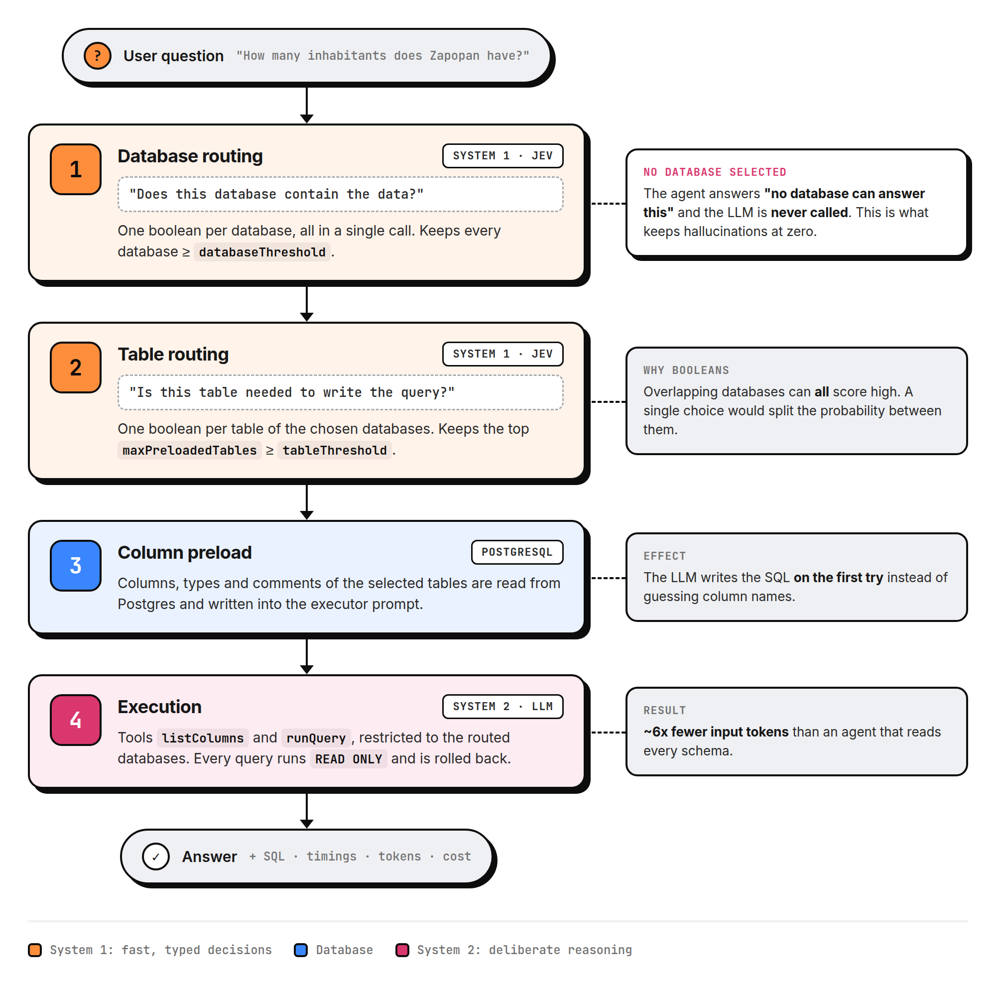
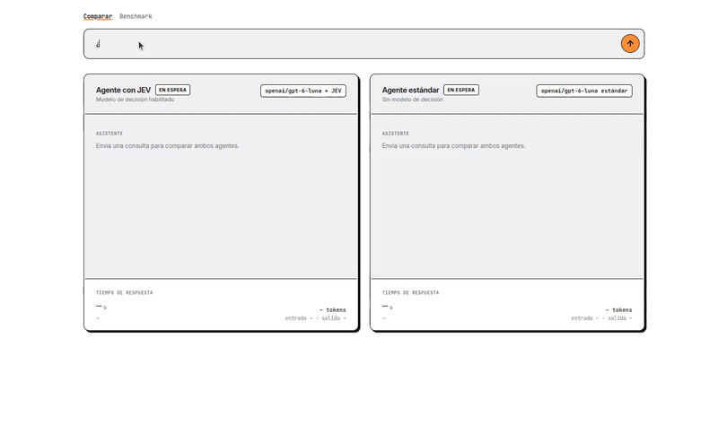
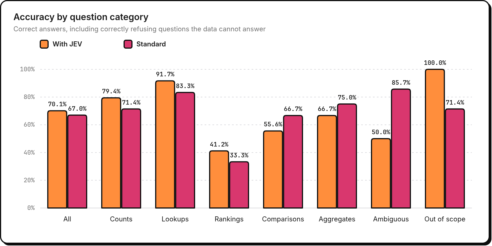
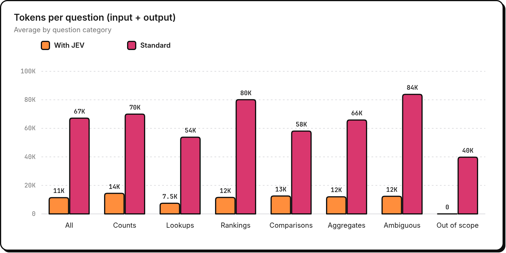
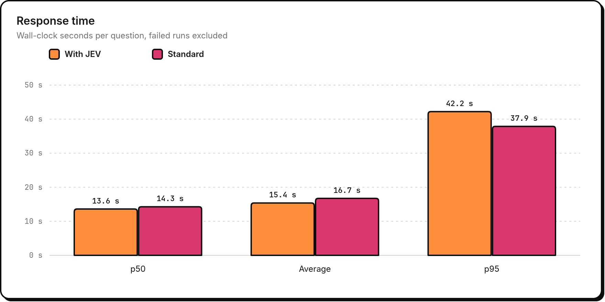

<h1 align="center">system-one-sql-agent</h1>

<p align="center">
  A text-to-SQL agent that lets a fast System One model decide <em>where</em> to look,
  so the LLM only has to think about <em>how</em> to query it.
</p>

<p align="center">
  <a href="LICENSE"></a>
  
  
  
</p>

> In *Thinking, Fast and Slow*, Daniel Kahneman describes two modes of thought: **System 1**,
> fast and intuitive, and **System 2**, slow and deliberate. TypeSafe AI borrowed the name for
> [System One models](https://typesafe.ai/blog/introducing-system-one-models-and-jev) such as
> Jev: models that make typed decisions instead of generating text. This project puts both
> systems to work together: System 1 routes, System 2 writes the SQL.

When a question can be answered by one of dozens of databases, a standard agent has to read
every schema before it can even start. This project splits that work in two:

1. **Route (System 1).** [Jev](https://vercel.com/ai-gateway/models/jev) scores every database,
   and then every table of the chosen databases, against the question in a single call each.
2. **Execute (System 2).** An LLM receives only the selected databases, with the columns of the
   most relevant tables preloaded, and writes read-only SQL to answer.

## Diagram

<p align="center">
  
</p>

## Demo

<p align="center">
  
</p>

## Features

- **Two-stage routing** - one Jev call picks the databases (boolean question per database), a
  second one picks the tables and preloads their columns into the prompt.
- **Honest "no data" answers** - when no database clears the threshold the agent says so
  instead of guessing, and skips the LLM entirely.
- **Read-only by construction** - every query runs inside a `READ ONLY` transaction with a
  statement timeout, and is always rolled back.
- **Side-by-side UI** - ask a question and watch the routed agent and a standard agent answer
  in parallel, with the SQL they ran, per-stage timings, and input/output tokens.
- **Reproducible benchmark** - 100 user-style questions, a verified gold-answer dataset with
  reference SQL, an automatic grader, and charts, all runnable from the UI or the CLI.
- **Pluggable executor** - any OpenAI-compatible model through `openai:` or `openrouter:`.

See [docs/features.md](docs/features.md) for how each piece works.

## Benchmark results

100 questions written like a real user would ask them, without looking at the schemas. 75 can
be answered with the data and 25 cannot (out-of-scope topics or data that is not loaded), so
the benchmark also measures hallucinations. Both agents use `openai/gpt-6-sol` (through
OpenRouter) as the executor, and see the same 30 Postgres databases.

<p align="center">
  
</p>

<p align="center">
  
</p>

<p align="center">
  
</p>

| Metric | With Jev routing | Standard agent |
| --- | --- | --- |
| Accuracy on answerable questions | 59.7% | **62.7%** |
| Hallucination rate on unanswerable questions | **0.0%** | 20.0% |
| Out-of-scope questions answered correctly | **100%** | 71.4% |
| Average input tokens per question | **11,071** | 66,665 |
| Estimated cost per question (list price) | **$0.026** | $0.138 |
| Latency p50 | **13.6 s** | 14.3 s |
| Executor time (average) | **11.6 s** | 16.7 s |
| Latency p95 | 42.2 s | **37.9 s** |

**p50** is the median: half of the questions were answered faster than that. **p95** is the
tail: 95% were faster and the slowest 5% took longer, so it shows the worst typical case.

What the numbers say:

- **It never hallucinated.** On the 25 questions the data cannot answer, the routed agent
  always said so; the standard agent invented an answer in 1 of every 5.
- **Overall it is more accurate: 70.1% vs 67.0%.** It is 3 points behind on answerable
  questions but ahead on counts, lookups and rankings; it loses on ambiguous questions, where
  reading every schema helps guess what the user meant.
- **Routing cuts input tokens by ~6x** and makes the executor ~30% faster, because the LLM no
  longer reads 30 schemas.
- **It is cheaper, by less than the tokens suggest.** At list price it costs about 5x less
  per question; the billed difference is smaller (roughly 2-3x in spot checks) because the
  standard agent's repeated prompt benefits from prompt caching.
- **The p95 latency is dominated by AI Gateway retries during outages**, not by Jev itself:
  Jev spends about 0.15 s per call inside the provider.

Treat these as a baseline rather than a verdict: thresholds are not tuned yet, 3 routed runs
failed on gateway outages (excluded), and 27 answers were flagged for manual review. Earlier
runs with `gpt-5.6-luna` showed the same token savings but a larger accuracy gap (49% vs
61%), so a stronger executor narrows the difference.

## Install

Requirements: Node.js 22+, [pnpm](https://pnpm.io), a PostgreSQL server with the databases
you want to query, an [AI Gateway](https://vercel.com/ai-gateway) key (for Jev) and an
OpenAI or OpenRouter key (for the executor).

```sh
git clone https://github.com/JoseVelazcoH/system-one-sql-agent.git
cd system-one-sql-agent
pnpm install
cp config.example.yaml config.yaml   # your model, databases and benchmark files
cp .env.example .env                 # your API keys and database password
pnpm catalog                         # build catalog.json from your databases
```

`catalog.json` holds a short description of every database and table. **Routing quality
depends on it**: review the generated descriptions and rewrite the weak ones by hand. Your
edits survive the next `pnpm catalog`.

## Quick start

```sh
pnpm dev               # UI on http://localhost:3000
```

- **`/`** compares both agents on the same question.
- **`/bench`** runs the benchmark (5, 20 or 100 questions), shows the charts and per-question
  results, and exports them to PDF or PNG.

From the command line:

```sh
pnpm ask "¿Cuántos habitantes tiene Jalisco?"
pnpm bench             # run the benchmark in both modes
pnpm bench:grade       # grade the latest run, write the report and charts
pnpm bench:refresh     # re-run the gold SQL to check the answers are still valid
```

## Configuration

Everything that is specific to you lives in two files that git ignores:

- **`config.yaml`**: your executor model, router thresholds, Postgres server, which databases to
  use, and your benchmark files. Start from the commented
  [`config.example.yaml`](config.example.yaml).
- **`.env`**: secrets only. The YAML never holds a key: it names the variable that does
  (`apiKeyEnv: AI_MODEL_API_KEY`), so a config file can be shared safely.

```yaml
executor:
  provider: openrouter          # openai | openrouter
  model: openai/gpt-5.6-luna
  apiKeyEnv: AI_MODEL_API_KEY
router:
  databaseThreshold: 0.5
  tableThreshold: 0.6
postgres:
  host: localhost
  user: postgres
  passwordEnv: PGPASSWORD
  databases: [sales, hr, inventory]   # or `exclude: [...]` to use the rest of the server
benchmark:
  questions: my-data/questions.json
  answers: my-data/answers.json
```

To bring your own benchmark, write your questions and gold answers in the format described in
[docs/features.md](docs/features.md#bring-your-own-benchmark) and point `benchmark` at them.
The repo ships an example dataset about public statistics of Mexico in
[`examples/mexico-public-data`](examples/mexico-public-data).

| Environment variable | Purpose |
| --- | --- |
| `AI_MODEL_API_KEY` | Executor provider key (name configurable) |
| `AI_GATEWAY_API_KEY` | Vercel AI Gateway key, used by Jev |
| `PGPASSWORD` | Postgres password (name configurable) |
| `CONFIG_FILE` | Use another config file instead of `config.yaml` |
| `HOST`, `PORT` | Where the UI listens (`127.0.0.1`, `3000`) |

The UI has no authentication and `/bench` can start paid LLM runs, so it only listens on
localhost by default. Put it behind authentication before exposing it with `HOST=0.0.0.0`.

## Contributing

Contributions are welcome! See [CONTRIBUTING.md](CONTRIBUTING.md) to get started, and please
follow our [Code of Conduct](CODE_OF_CONDUCT.md).

## License

Released under the [GNU General Public License v3.0](LICENSE).
