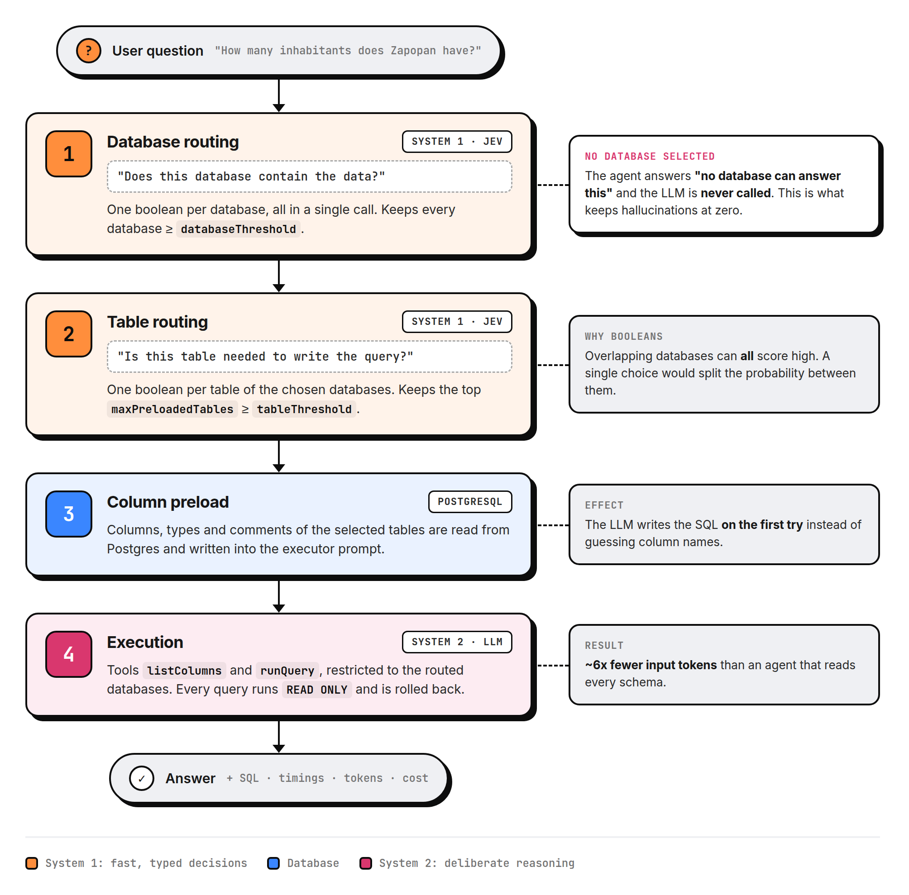
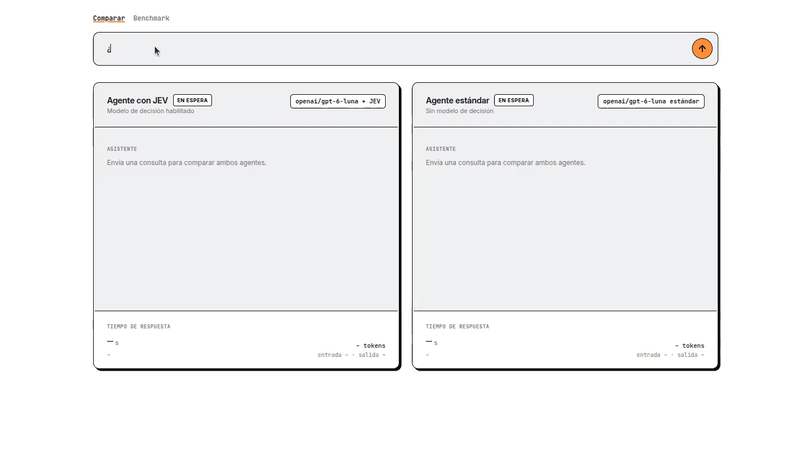
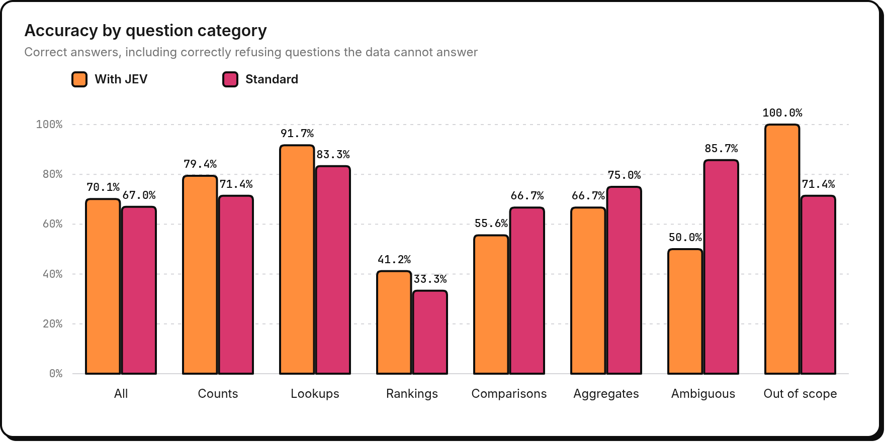
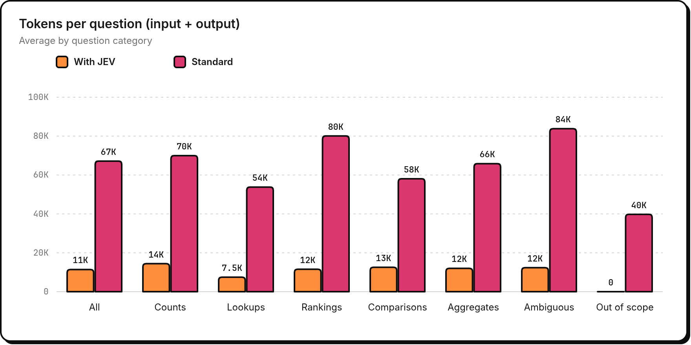
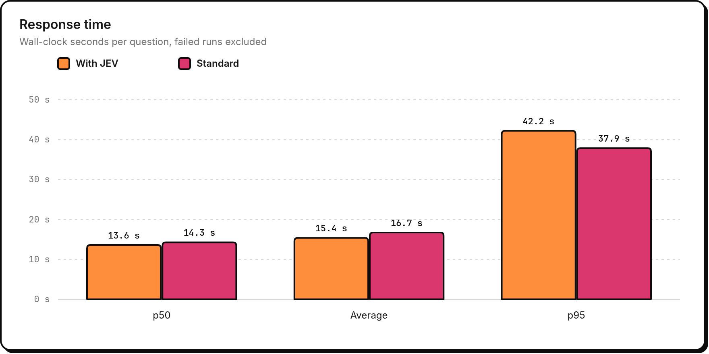

# system-one-sql-agent

<p align="center">
  <b>A text-to-SQL agent that decides where to look before it thinks</b>
</p>
<p align="center">
  A fast System One model picks the databases and tables, so the LLM only has to write the query.
</p>

<div align="center">

  
  
  

</div>

<br>

## &nbsp; The Problem
When a question could be answered by any of dozens of databases, a standard agent pays for it on every question.

<table width="100%">
  <tr>
    <td width="33%" valign="top" align="center">
      <br>
      <h3 align="center">&nbsp; Every Schema</h3>
      <p align="center">It has to read every schema before it can start. With 30 databases, that is over 66,000 input tokens per question.</p>
      <br>
    </td>
    <td width="33%" valign="top" align="center">
      <br>
      <h3 align="center">&nbsp; Invented Answers</h3>
      <p align="center">When the data does not exist, it still finds something close and answers anyway: 1 in 5 times in our benchmark.</p>
      <br>
    </td>
    <td width="33%" valign="top" align="center">
      <br>
      <h3 align="center">&nbsp; Slow and Costly</h3>
      <p align="center">A long prompt on every call means a slower executor and a bigger bill, even for a simple count.</p>
      <br>
    </td>
  </tr>
</table>

<br>

## &nbsp; The Solution
The agent treats it as a **routing problem** before a generation problem. In *Thinking, Fast and Slow*, Daniel Kahneman describes **System 1**, fast and intuitive, and **System 2**, slow and deliberate. TypeSafe AI borrowed the name for [System One models](https://typesafe.ai/blog/introducing-system-one-models-and-jev) such as Jev, which make typed decisions instead of generating text. Here System 1 routes and System 2 writes the SQL.

### How it works
<p align="center">
  
</p>

1.  **Pick databases:** [Jev](https://vercel.com/ai-gateway/models/jev) answers one yes/no question per database ("does it contain the data?") in a single call.
2.  **Pick tables:** a second Jev call scores every table of the chosen databases.
3.  **Load columns:** only the chosen tables' columns are read from Postgres and preloaded into the prompt.
4.  **Write the SQL:** the LLM writes read-only SQL against the routed databases. Every query runs inside a `READ ONLY` transaction with a statement timeout, and is always rolled back.

> When no database clears the threshold, the agent says the data is not available and skips the LLM entirely. See [docs/features.md](docs/features.md) for how each piece works.

<br>

## &nbsp; Demo
<p align="center">
  
</p>

<br>

## &nbsp; What We Measured
100 questions written like a real user would ask them, without looking at the schemas. 75 can be answered with the data and 25 cannot (out-of-scope topics or data that is not loaded), so the benchmark also measures hallucinations. Both agents use `openai/gpt-6-sol` (through OpenRouter) as the executor and see the same 30 Postgres databases.

| **Metric**                                   | **With Jev routing** | **Standard agent** |
| :------------------------------------------- | :------------------: | :----------------: |
| Accuracy on answerable questions             | 59.7%                | **62.7%**          |
| Hallucination rate on unanswerable questions | **0.0%**             | 20.0%              |
| Out-of-scope questions answered correctly    | **100%**             | 71.4%              |
| Average input tokens per question            | **11,071**           | 66,665             |
| Estimated cost per question (list price)     | **$0.026**           | $0.138             |
| Latency p50                                  | **13.6 s**           | 14.3 s             |
| Executor time (average)                      | **11.6 s**           | 16.7 s             |
| Latency p95                                  | 42.2 s               | **37.9 s**         |

- **It never hallucinated.** On the 25 questions the data cannot answer, the routed agent always said so.
- **Overall it is more accurate: 70.1% vs 67.0%.** It is 3 points behind on answerable questions, ahead on counts, lookups and rankings, and behind on ambiguous questions, where reading every schema helps guess what the user meant.
- **Routing cuts input tokens by ~6x** and makes the executor ~30% faster.
- **It is cheaper, by less than the tokens suggest.** About 5x at list price, roughly 2-3x billed in spot checks, because the standard agent's repeated prompt benefits from prompt caching.
- **The p95 is dominated by AI Gateway retries during outages**, not by Jev, which spends about 0.15 s per call inside the provider.

<details>
<summary>Charts: accuracy, tokens and latency</summary>

<p align="center">
  
</p>
<p align="center">
  
</p>
<p align="center">
  
</p>

</details>

> [!NOTE]
> Treat these as a baseline, not a verdict: thresholds are not tuned yet, 3 routed runs failed on gateway outages (excluded), and 27 answers were flagged for manual review. Earlier runs with `gpt-5.6-luna` showed the same token savings but a larger accuracy gap (49% vs 61%), so a stronger executor narrows the difference. **p50** is the median; **p95** means 95% of questions were faster.

<br>

## &nbsp; Tech Stack
A small TypeScript service with a plain HTML UI. Jev decides, the executor LLM writes SQL, Postgres answers.

| **Component**    | **Technology**                                                                                               | **Description**                                                                                     |
| :--------------- | :----------------------------------------------------------------------------------------------------------- | :-------------------------------------------------------------------------------------------------- |
| **Agent**        |                                    | Node.js 22+ run with tsx. Routing, execution and the HTTP server in `src/`.                         |
| **Router**       |                                            | [Jev](https://vercel.com/ai-gateway/models/jev) through the [Vercel AI Gateway](https://vercel.com/ai-gateway). |
| **Executor**     |           | Any OpenAI-compatible model via `openai:` or `openrouter:`, with the [AI SDK](https://ai-sdk.dev).  |
| **Database**     |                                          | PostgreSQL, read-only transactions with a statement timeout.                                        |
| **UI**           |                                       | Side-by-side comparison at `/` and the benchmark runner at `/bench`.                               |

<br>

## &nbsp; Getting Started

### Requirements

- Node.js 22+ and [pnpm](https://pnpm.io)
- A PostgreSQL server with the databases you want to query
- An [AI Gateway](https://vercel.com/ai-gateway) key (for Jev) and an OpenAI or OpenRouter key (for the executor)

### Install

```sh
git clone https://github.com/JoseVelazcoH/system-one-sql-agent.git
cd system-one-sql-agent
pnpm install
cp config.example.yaml config.yaml   # your model, databases and benchmark files
cp .env.example .env                 # your API keys and database password
pnpm catalog                         # build catalog.json from your databases
```

`catalog.json` holds a short description of every database and table. **Routing quality depends on it**: review the generated descriptions and rewrite the weak ones by hand. Your edits survive the next `pnpm catalog`.

### Run it

```sh
pnpm dev               # UI on http://localhost:3000
```

- **`/`** compares both agents on the same question.
- **`/bench`** runs the benchmark (5, 20 or 100 questions), shows the charts and per-question results, and exports them to PDF or PNG.

From the command line:

```sh
pnpm ask "¿Cuántos habitantes tiene Jalisco?"
pnpm bench             # run the benchmark in both modes
pnpm bench:grade       # grade the latest run, write the report and charts
pnpm bench:refresh     # re-run the gold SQL to check the answers are still valid
```

### Configuration

Everything specific to you lives in two files that git ignores:

- **`config.yaml`**: executor model, router thresholds, Postgres server, which databases to use, and your benchmark files. Start from the commented [`config.example.yaml`](config.example.yaml).
- **`.env`**: secrets only. The YAML never holds a key: it names the variable that does (`apiKeyEnv: AI_MODEL_API_KEY`), so a config file can be shared safely.

```yaml
executor:
  provider: openrouter          # openai | openrouter
  model: openai/gpt-5.6-luna
  apiKeyEnv: AI_MODEL_API_KEY
router:
  databaseThreshold: 0.5
  tableThreshold: 0.6
postgres:
  host: localhost
  user: postgres
  passwordEnv: PGPASSWORD
  databases: [sales, hr, inventory]   # or `exclude: [...]` to use the rest of the server
benchmark:
  questions: my-data/questions.json
  answers: my-data/answers.json
```

| **Environment variable** | **Purpose**                                         |
| :----------------------- | :-------------------------------------------------- |
| `AI_MODEL_API_KEY`       | Executor provider key (name configurable)           |
| `AI_GATEWAY_API_KEY`     | Vercel AI Gateway key, used by Jev                  |
| `PGPASSWORD`             | Postgres password (name configurable)               |
| `CONFIG_FILE`            | Use another config file instead of `config.yaml`    |
| `HOST`, `PORT`           | Where the UI listens (`127.0.0.1`, `3000`)          |

To bring your own benchmark, write your questions and gold answers in the format described in [docs/features.md](docs/features.md#bring-your-own-benchmark) and point `benchmark` at them. The repo ships an example dataset about public statistics of Mexico in [`examples/mexico-public-data`](examples/mexico-public-data).

<br>

## &nbsp; Community
- [Contributing](docs/CONTRIBUTING.md)
- [Commit convention](docs/commits-convention.md)
- [Code of conduct](docs/CODE_OF_CONDUCT.md)
- [Security policy](docs/SECURITY.md)

<br>

## &nbsp; Acknowledgements
- [Jev](https://vercel.com/ai-gateway/models/jev) and [System One models](https://typesafe.ai/blog/introducing-system-one-models-and-jev) by TypeSafe AI: the router behind every decision
- [AI SDK](https://ai-sdk.dev) and [AI Gateway](https://vercel.com/ai-gateway) by Vercel: model access for both systems
- *Thinking, Fast and Slow* by Daniel Kahneman: the idea behind the name

<br>

> [!IMPORTANT]
> The UI has no authentication and `/bench` can start paid LLM runs, so it only listens on localhost by default. Put it behind authentication before exposing it with `HOST=0.0.0.0`.

<br>

## &nbsp; License
Released under the [GPL-3.0](LICENSE) license.
